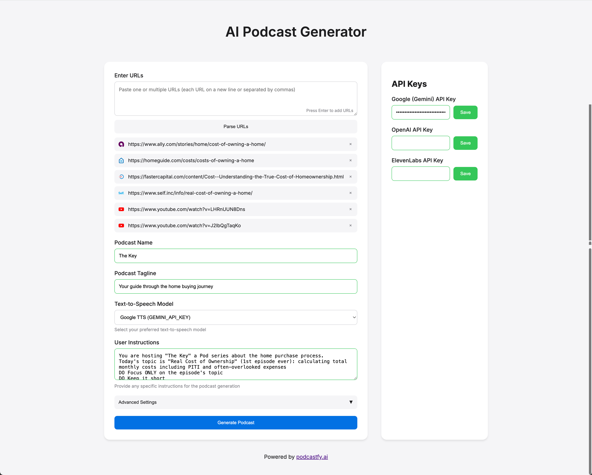

# AI Podcast Generator 🎙️

A modern web application that automatically generates engaging podcast conversations from URLs or news topics using AI. Powered by [podcastfy.ai](http://podcastfy.ai).



## ✨ Features

- **Two Generation Modes**:
  - Custom Podcast: Generate from URLs
  - News Podcast: Generate from news topics
- **URL Processing**: Paste multiple URLs to generate content from various sources
- **Multiple TTS Options**:
  - Google TTS (GEMINI) - _Required for News Podcasts_
  - OpenAI TTS (Custom Podcasts only)
  - ElevenLabs TTS (Custom Podcasts only)
- **Customizable Settings**:
  - Word count
  - Creativity level
  - Conversation styles
  - Dialogue structure
  - Engagement techniques
- **Persistent Settings**: All settings are saved locally
- **Modern UI**: Clean, responsive interface with Apple-inspired design
- **Real-time Preview**: URL previews with favicons
- **Progress Indicator**: Visual feedback during generation

## 🚀 Quick Start

### Prerequisites

- Python 3.9+
- Google (Gemini) API key (required for all features)
- Optional for Custom Podcasts:
  - OpenAI API key
  - ElevenLabs API key

### Local Development

1. Clone the repository:

```bash
git clone https://github.com/giulioco/podcastfy-ui.git
cd podcastfy-ui
```

2. Create a virtual environment and activate it:

```bash
python -m venv venv
source venv/bin/activate  # On Windows use: venv\Scripts\activate
```

3. Install dependencies:

```bash
pip install -r requirements.txt
```

4. Create a `.env` file in the root directory:

```env
GEMINI_API_KEY=your_gemini_api_key
OPENAI_API_KEY=your_openai_api_key  # Optional
ELEVENLABS_API_KEY=your_elevenlabs_api_key  # Optional
```

5. Run the development server:

```bash
python dev.py
```

6. Open `http://localhost:8080` in your browser

### Production Deployment

This application is configured to deploy on Fly.io. For deployment instructions, please see the [Fly.io deployment guide](https://fly.io/docs/languages-and-frameworks/python/).

1. Install the Fly.io CLI
2. Login to Fly.io: `fly auth login`
3. Deploy: `fly launch`
4. Set your secrets: `fly secrets set GEMINI_API_KEY=your_key_here`
5. Deploy: `fly deploy`

## 🛠️ Configuration

### Advanced Settings

The application supports various customization options for Custom Podcasts:

```python
conversation_config = {
    'word_count': 4000,
    'creativity': 0.7,
    'conversation_style': [
        'Engaging', 'Fast-paced', 'Enthusiastic', 'Educational'
    ],
    'dialogue_structure': [
        'Topic Introduction', 'Summary of Key Points',
        'Discussions', 'Q&A Session', 'Farewell Messages'
    ],
    'engagement_techniques': [
        'Rhetorical Questions', 'Personal Testimonials',
        'Quotes', 'Anecdotes', 'Analogies', 'Humor'
    ]
}
```

### Environment Variables

Required environment variables:

- `GEMINI_API_KEY`: For Google's Gemini model (required for all features)

Optional environment variables (for Custom Podcasts):

- `OPENAI_API_KEY`: For OpenAI's services
- `ELEVENLABS_API_KEY`: For ElevenLabs TTS

## 📁 Project Structure

```
podcast-generator/
├── api/              # Serverless API functions
│   └── index.py      # Main Flask application
├── templates/        # HTML templates
│   └── index.html    # Main UI template
├── static/          # Static files
│   └── audio/       # Generated podcasts
├── dev.py          # Local development server
├── vercel.json     # Vercel configuration
├── requirements.txt # Python dependencies
└── .env            # Environment variables
```

## 💡 Usage Tips

1. **Mode Selection**:

   - Choose between Custom Podcast and News Podcast modes
   - News Podcasts use Google TTS exclusively
   - Custom Podcasts support multiple TTS options

2. **URL Input** (Custom Podcast mode):

   - Paste multiple URLs separated by newlines or commas
   - URLs are automatically parsed and displayed with favicons
   - Remove URLs by clicking the 'x' button

3. **News Topics** (News Podcast mode):

   - Enter any news topic to generate a podcast
   - Uses Google TTS for optimal news delivery
   - Automatically fetches and processes latest news

4. **API Keys**:

   - Keys are stored locally in your browser
   - Never transmitted except during podcast generation
   - Can be cleared using the "Clear Form" button

5. **Advanced Settings** (Custom Podcast mode):
   - Click "Advanced Settings" to customize generation
   - All settings persist across page reloads
   - Experiment with different combinations for optimal results

## 🚀 Deployment

### Deploy to Vercel

1. Install Vercel CLI:

```bash
npm install -g vercel
```

2. Login to Vercel:

```bash
vercel login
```

3. Deploy:

```bash
vercel
```

4. Add environment variables in Vercel dashboard:
   - `GEMINI_API_KEY`: For Google's Gemini model (required)
   - `OPENAI_API_KEY`: For OpenAI's services (optional)
   - `ELEVENLABS_API_KEY`: For ElevenLabs TTS (optional)

### Local Development

1. Clone the repository:

```bash
git clone https://github.com/giulioco/podcastfy-ui.git
cd podcastfy-ui
```

2. Install dependencies:

```bash
pip install -r requirements.txt
```

3. Create a `.env` file with your API keys

4. Run the development server:

```bash
python dev.py
```

5. Open `http://localhost:5000` in your browser

## 🤝 Contributing

1. Fork the repository
2. Create a feature branch: `git checkout -b feature-name`
3. Commit changes: `git commit -am 'Add feature'`
4. Push to branch: `git push origin feature-name`
5. Submit a Pull Request

## 📝 License

This project is licensed under the MIT License - see [LICENSE](LICENSE) for details.

## 🙏 Acknowledgments

- Powered by [podcastfy.ai](http://podcastfy.ai)
- UI inspired by Apple's design guidelines
- Icons from Google's favicon service

## 🔒 Security

- API keys are stored in browser's localStorage
- Keys are only used during podcast generation
- No data is permanently stored on servers
- Generated audio files are temporary

## 🚧 Known Issues

- Generation time varies with content length
- Some TTS services have rate limits
- Audio quality depends on chosen TTS provider

## 🗺 Roadmap

- [ ] Multiple language support
- [ ] Custom voice selection
- [ ] Batch processing
- [ ] Audio post-processing
- [ ] Podcast hosting integration
